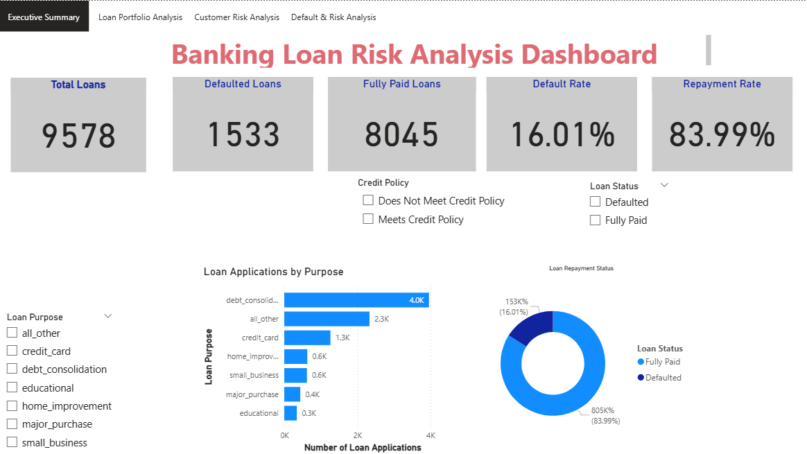
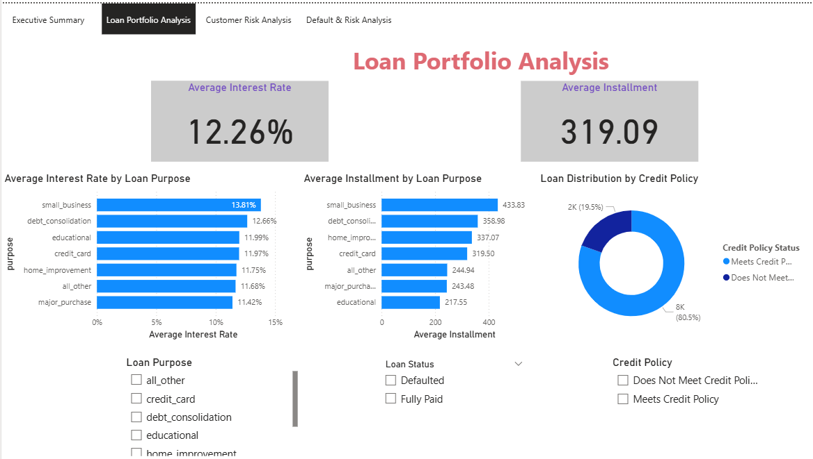
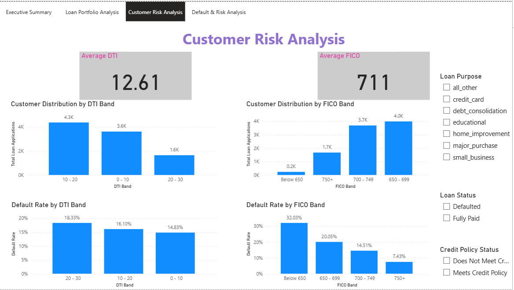
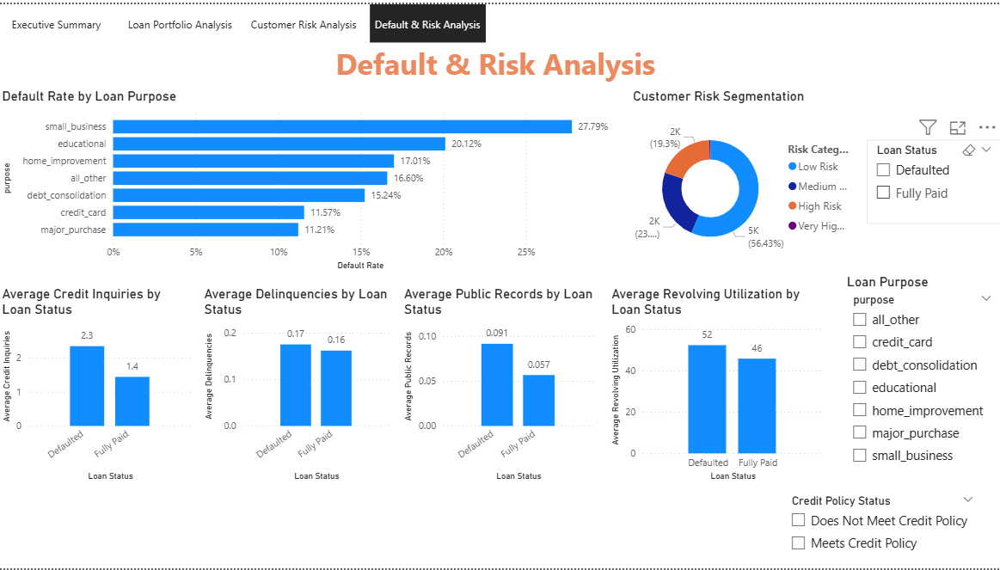

<div align="center">

# 🏦 Banking Loan Risk Analysis

### End-to-End Data Analytics Project using Excel | SQL Server | Python | Power BI

</div>

---

# 📌 Project Overview

This project presents an end-to-end Banking Loan Risk Analysis solution developed using **Excel, SQL Server, Python, and Power BI**. The objective is to analyze customer loan data, identify the major factors contributing to loan defaults, and generate business insights that support data-driven lending decisions.

The project demonstrates the complete Data Analytics workflow—from raw data cleaning and SQL analysis to Python exploratory data analysis (EDA) and an interactive Power BI dashboard.

---

# 🎯 Business Problem

Banks process thousands of loan applications every year. Approving loans without understanding customer risk can lead to significant financial losses.

This project helps answer business questions such as:

- Which customers are more likely to default?
- Does FICO score affect repayment?
- How does Debt-to-Income (DTI) ratio impact loan default?
- Which loan purpose has the highest default rate?
- How can customers be segmented into different risk categories?

---

# 📊 Dataset Information

| Attribute | Details |
|-----------|----------|
| Domain | Banking / Finance |
| Records | 9,578 |
| Features | 14 |
| Target Variable | not_fully_paid |

---

# 🛠️ Tools & Technologies

- Microsoft Excel
- SQL Server
- Python
- Pandas
- NumPy
- Matplotlib
- Power BI
- DAX

---

# 🔄 Project Workflow

```text
Loan Dataset (CSV)
        │
        ▼
Excel Data Cleaning & Analysis
        │
        ▼
SQL Server Business Queries
        │
        ▼
Python Data Cleaning & EDA
        │
        ▼
Power BI Dashboard
        │
        ▼
Business Insights & Decision Support
```

---

# 📂 Project Structure

```text
Banking_Loan_Risk_Analysis/
│
├── data/
│   └── loan_data.csv
│
├── excel/
│   └── Loan_Risk_Analysis.xlsx
│
├── sql/
│   ├── schema.sql
│   ├── data_import.sql
│   ├── business_queries.sql
│   └── advanced_sql.sql
│
├── python/
│   └── Banking_Loan_Risk_Analysis.ipynb
│
├── powerbi/
│   └── Banking_Loan_Risk_Analysis.pbix
│
├── dashboard_images/
│   ├── Executive_Summary.png
│   ├── Loan_Portfolio_Analysis.png
│   ├── Customer_Risk_Analysis.png
│   └── Default_Risk_Analysis.png
│
└── README.md
```

---

# 📈 Power BI Dashboard

## Executive Summary



---

## Loan Portfolio Analysis



---

## Customer Risk Analysis



---

## Default & Risk Analysis



---

# 📊 Dashboard Features

### Executive Summary

- Total Loan Applications
- Default Rate
- Repayment Rate
- Loan Purpose Distribution
- Interactive Slicers

### Loan Portfolio Analysis

- Average Interest Rate
- Average Installment
- Credit Policy Distribution
- Loan Purpose Analysis

### Customer Risk Analysis

- Average FICO Score
- Average Debt-to-Income Ratio
- FICO Band Distribution
- DTI Band Distribution
- Default Rate by FICO Band
- Default Rate by DTI Band

### Default & Risk Analysis

- Default Rate by Loan Purpose
- Revolving Utilization Analysis
- Credit Inquiry Analysis
- Delinquency Analysis
- Public Records Analysis
- Customer Risk Segmentation

---

# 🔍 Key Business Insights

- Customers with lower FICO scores are more likely to default.
- Higher Debt-to-Income (DTI) ratios increase the probability of loan default.
- Small Business loans have the highest default rate.
- Customers with higher revolving credit utilization are more likely to default.
- Defaulted customers generally have more recent credit inquiries.
- Most approved loans satisfy the bank's credit policy requirements.

---

# 📈 SQL Analysis

Business queries performed include:

- Total Loan Applications
- Default Rate Analysis
- Loan Purpose Analysis
- Interest Rate Analysis
- Installment Analysis
- Credit Policy Analysis
- FICO Analysis
- DTI Analysis
- Revolving Utilization Analysis
- Credit Inquiry Analysis
- CTEs
- Window Functions
- ROW_NUMBER()
- RANK()
- DENSE_RANK()
- Risk Segmentation
- Top N Analysis
- Views

---

# 🐍 Python Analysis

Performed using:

- Pandas
- NumPy
- Matplotlib

Analysis includes:

- Data Cleaning
- Missing Value Analysis
- Duplicate Detection
- Exploratory Data Analysis (EDA)
- Loan Purpose Analysis
- Default Distribution
- Correlation Analysis
- Business Insights

---

# 📊 Power BI Features

- Interactive Dashboard
- KPI Cards
- DAX Measures
- Slicers
- Page Navigation
- Drill-down Analysis
- Risk Segmentation
- Business KPIs

---

# 💼 Skills Demonstrated

- Data Cleaning
- Data Transformation
- SQL Query Writing
- Exploratory Data Analysis (EDA)
- Business Intelligence
- Dashboard Development
- DAX
- Data Visualization
- Financial Risk Analysis
- Problem Solving

---

# 🚀 Future Improvements

- Machine Learning Loan Default Prediction
- Live SQL Database Connection
- Power BI Service Deployment
- Automated Dashboard Refresh
- Real-time Loan Monitoring

---

# 👩‍💻 Author

**Bhavana**

End-to-End Data Analytics Project using Excel, SQL Server, Python, and Power BI.

---

# ⭐ If you found this project useful, consider giving it a Star!


## 👩‍💻 Author

**Bhavana**

End-to-End Data Analytics Project using Excel, SQL Server, Python, and Power BI.
